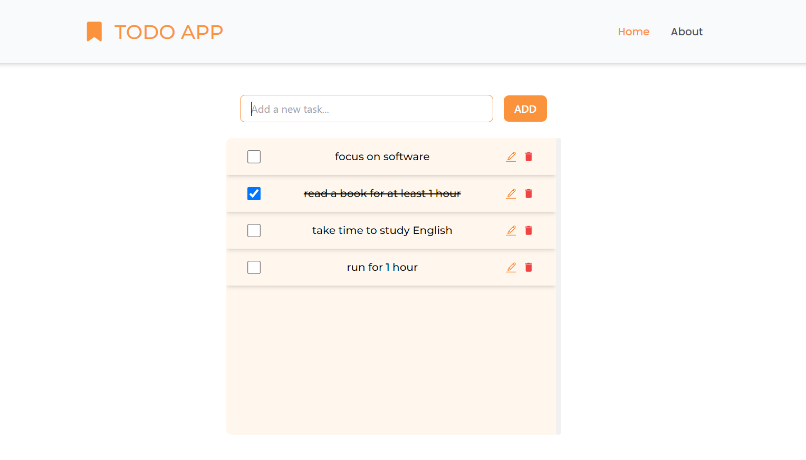

# MERN Stack Todo List Uygulaması

Bu proje, MERN (MongoDB, Express, React, Node.js) Stack kullanılarak geliştirilmiş basit bir Todo List uygulamasıdır. Kullanıcılar görev ekleyebilir, güncelleyebilir ve silebilir. Proje full-stack bir yapıdadır ve veriler MongoDB'de depolanmaktadır.

## Özellikler

- Görev ekleme
- Görev güncelleme
- Görev silme
- Tüm görevleri listeleme

## Kurulum

### Gerekli Bağımlılıklar

- Node.js
- MongoDB (Yerel veya bulut tabanlı)
- NPM veya Yarn (Tercihinize göre)
